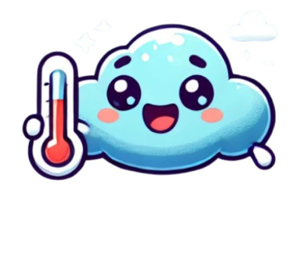

    <h1 style="display: inline; margin: 0;">HeatCife</h1>
    

### Pré-Projeto: App de Monitoramento de Gases do Efeito 

**Tema:** Descubra o papel dos gases e efeito estufa em seu bairro 

### **1. Problema**
A crescente emissão de gases de efeito estufa (GEE) e a falta de acesso a informações claras e locais sobre seus impactos têm levado a uma desinformação generalizada sobre o tema. No contexto de bairros, a ausência de ferramentas acessíveis que permitam visualizar a qualidade do ar e as emissões de GEE contribui para a baixa conscientização sobre o efeito estufa e seus riscos para a saúde e o meio ambiente.

**Principais Problemas:**
- **Queimadas:** Aumentam as emissões de GEE, impactando diretamente a qualidade do ar.
- **Desinformação:** Falta de mapas acessíveis e ferramentas que permitam a visualização de gases emitidos por região.
- **Impactos na Saúde:** A população não tem informações em tempo real sobre como a poluição afeta sua saúde.

---

### **2. Objetivo**
Desenvolver um aplicativo que:
- **Leve informação**: Acesso e conscientização sobre os gases de efeito estufa, qualidade do ar e suas causas e efeitos.
- **Alcance amplo**: Forneça dados locais e globais. 
- **Estimule a ação**: Ofereça dados para que outras plataformas possam acessar essas informações e utiliza-las.

---

### **3. Público-Alvo**
- **Acadêmicos e pesquisadores**: Interessados em dados sobre emissões e impacto ambiental.
- **População em geral**: Que busca entender melhor a qualidade do ar em seu bairro e os impactos dos gases de efeito estufa.
- **Empresas de tecnologia**: Potenciais parceiras para integração de dados e soluções tecnológicas.
  
---

### **4. Solução Proposta**
Desenvolver um **aplicativo móvel** com as seguintes funcionalidades principais:

- **Mapa Interativo**: Exibe um mapa global com informações detalhadas sobre a emissão de gases de efeito estufa.
- **Pesquisa Personalizada**: Permite ao usuário buscar por dados de emissão de gases e qualidade do ar em diferentes áreas (local e global).
- **Previsão por IA**: Utiliza inteligência artificial para prever emissões futuras com base em tendências e dados históricos.
- **Alertas Climáticos em tempo real**: Notificações em tempo real sobre a qualidade do ar, riscos de queimadas e outras condições climáticas,  níveis de poluentes atmosféricos e seus efeitos na saúde.
- **Integração Multiplataforma**: Facilita o compartilhamento de dados com outras plataformas e redes sociais.
  
---

### **5. Tecnologias Utilizadas**
- **BI (Business Intelligence)**: Para análise e visualização de dados de localização, ajudando a mapear as áreas com maiores emissões.
- **Python + Streamlit**: Para o desenvolvimento de dashboards interativos e visualizações dinâmicas dos dados.
- **API de Qualidade do Ar**: Integração com plataformas que fornecem dados sobre poluentes em tempo real.
- **IA para Previsão de Emissões**: Uso de machine learning para prever cenários de emissão de gases com base em dados históricos e em tempo real.

---

### **6. Impacto Esperado**
- **Aumento da Conscientização**: Facilitar o entendimento dos efeitos dos gases de efeito estufa no nível local, levando a ações mais concretas por parte da população e empresas.
- **Tomada de Decisão Informada**: Prover dados para que as pessoas tomem decisões mais conscientes sobre o impacto ambiental em suas áreas.
- **Redução de Emissões**: Incentivar iniciativas de mitigação e redução de emissões tanto para indivíduos quanto para empresas.

---
### Equipe Desenvolvedora

- [Dayane Araujo](https://github.com/dayanearauj0)
- [Delis Guerra](https://github.com/DelisG)
- [Gustavo Lima](https://github.com/custafo)
- Joab Tomaz
- [Luiz Augusto](https://github.com/luizferrazz)

